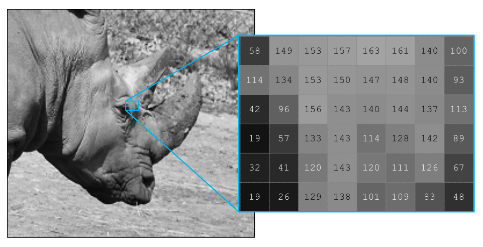
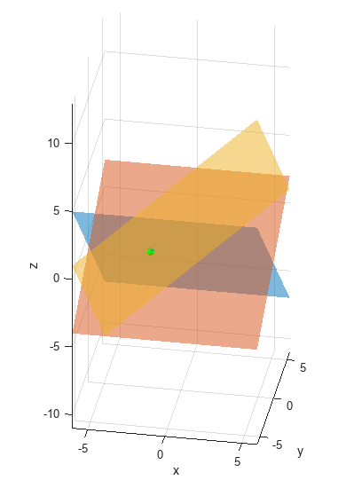
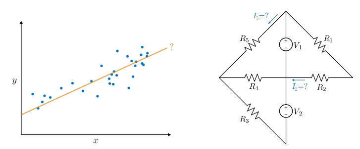
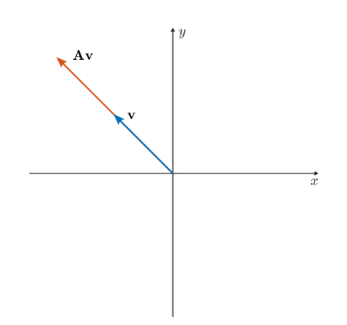
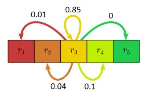
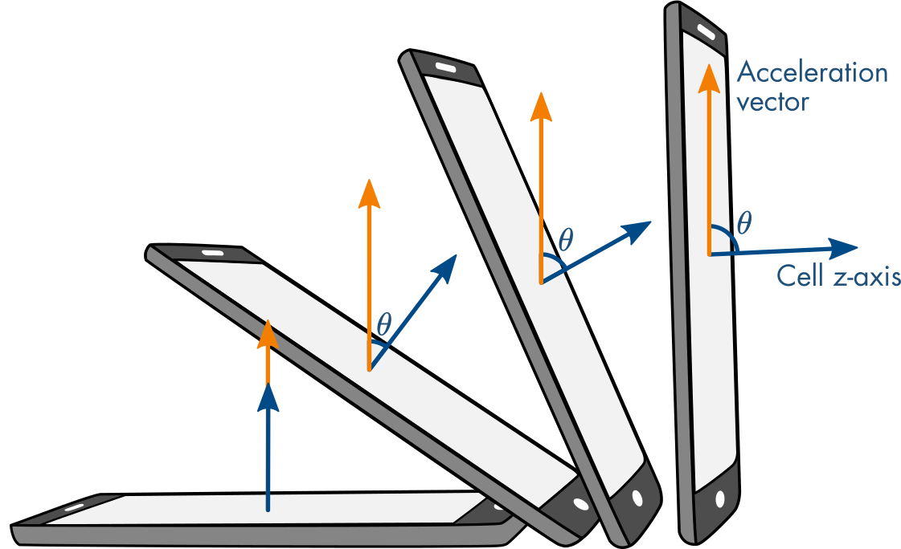

# Matrix Methods of Linear Algebra

 or 

**Curriculum Module**

_Created with R2024a. Compatible with R2024a and later releases._

# Information

This curriculum module contains interactive [MATLAB® live scripts](https://www.mathworks.com/products/matlab/live-editor.html) that teach fundamental matrix methods commonly taught in introductory linear algebra courses. In the first part of each live script, students learn standard definitions, visualize concepts, and perform exercises on paper. Afterward, students practice complementary MATLAB® methods. These methods reinforce the discussed concepts and help students to develop an early familiarity with computational software. Each lesson concludes with an illustrative application.

## Background

You can use these live scripts as demonstrations in lectures, class activities, or interactive assignments outside class. This module covers topics such as matrix operations, linear systems, determinants, eigenvalues and eigenvectors, and diagonalization. It also includes examples of using matrix methods to modify grayscale images, analyze linear circuits, understanding vibrations, and Markov chains.

The instructions inside the live scripts will guide you through the exercises and activities. Get started with each live script by running it one section at a time. To stop running the script or a section midway (for example, when an animation is in progress), use the  Stop button in the **RUN** section of the **Live Editor** tab in the MATLAB Toolstrip.

## Contact Us

Solutions are available upon instructor request. Contact the [MathWorks teaching resources team](mailto:onlineteaching@mathworks.com) if you would like to request solutions, provide feedback, or if you have a question.

## Getting Started
### Accessing the Module
### **On MATLAB Online:**

Use the  link to download the module. You will be prompted to log in or create a MathWorks account. The project will be loaded, and you will see an app with several navigation options to get you started.

### **On Desktop:**

Download or clone this repository. Open MATLAB, navigate to the folder containing these scripts and double\-click on [MatrixMethods.prj](https://matlab.mathworks.com/open/github/v1?repo=MathWorks-Teaching-Resources/Matrix-Methods-of-Linear-Algebra&project=MatrixMethods.prj&file=README.mlx). It will add the appropriate files to your MATLAB path and open an app that asks you where you would like to start. 

Ensure you have all the required products (listed below) installed. If you need to include a product, add it using the Add\-On Explorer. To install an add\-on, go to the **Home** tab and select   **Add-Ons** > **Get Add-Ons**. 

## Products

MATLAB® is used throughout. Tools from Symbolic Math Toolbox™, Statistics and Machine Learning Toolbox™, and Image Processing Toolbox™ are used as well.

# Scripts
## [**MatrixOperations.mlx**](https://matlab.mathworks.com/open/github/v1?repo=MathWorks-Teaching-Resources/Matrix-Methods-of-Linear-Algebra&project=MatrixMethods.prj&file=Scripts/MatrixOperations.mlx)
|      |      |      |
| :-- | :-- | :-- |
|     | **In this script, students will...**   $\bullet$ Define matrices and their basic arithmetic operations   $\bullet$ Calculate the result of matrix operations on paper and in MATLAB   $\bullet$ Explain the size requirements of matrix operations   $\bullet$ Compare symbolic and numeric matrix operations in MATLAB   $\bullet$ Apply matrix methods to modify grayscale images    | **Academic disciplines**   $\bullet$ Linear algebra   $\bullet$ Image processing     |
|      |      |       |

## [**LinearSystems.mlx**](https://matlab.mathworks.com/open/github/v1?repo=MathWorks-Teaching-Resources/Matrix-Methods-of-Linear-Algebra&project=MatrixMethods.prj&file=Scripts/LinearSystems.mlx)
|      |      |      |
| :-- | :-- | :-- |
|     | **In this script, students will...**   $\bullet$ Write a linear system in matrix form   $\bullet$ Relate solutions of linear systems in 3\-dimensions to their visualizations   $\bullet$ Solve systems of linear equations using row\-reduction and matrix inverses   $\bullet$ Explain the solvability of a linear system in terms of the matrix determinant   $\bullet$ Use MATLAB to solve linear systems    | **Academic disciplines**   $\bullet$ Linear algebra     |
|      |      |       |

## [**LinearSystemsApplications.mlx**](https://matlab.mathworks.com/open/github/v1?repo=MathWorks-Teaching-Resources/Matrix-Methods-of-Linear-Algebra&project=MatrixMethods.prj&file=Scripts/LinearSystemsApplications.mlx)
|      |      |      |
| :-- | :-- | :-- |
|     | **In this script, students will...**   $\bullet$ Apply matrix methods to linear regression and linear circuit analysis    | **Academic disciplines**   $\bullet$ Linear algebra   $\bullet$ Statistical analysis   $\bullet$ Circuit analysis     |
|      |      |       |

## [**Eigenanalysis.mlx**](https://matlab.mathworks.com/open/github/v1?repo=MathWorks-Teaching-Resources/Matrix-Methods-of-Linear-Algebra&project=MatrixMethods.prj&file=Scripts/Eigenanalysis.mlx)
|      |      |      |
| :-- | :-- | :-- |
|     | **In this script, students will...**   $\bullet$ Visualize eigenvectors in 2\-dimensions   $\bullet$ Solve for the eigenvalues and eigenvectors of a 2x2 matrix on paper and larger matrices using MATLAB   $\bullet$ Diagonalize 2x2 matrices on paper and larger matrices in MATLAB   $\bullet$ Explain linear system solvability in terms of eigenvalues   $\bullet$ Discuss defective matrices    | **Academic disciplines**   $\bullet$ Linear algebra     |
|      |      |       |

## [**EigenanalysisApplications.mlx**](https://matlab.mathworks.com/open/github/v1?repo=MathWorks-Teaching-Resources/Matrix-Methods-of-Linear-Algebra&project=MatrixMethods.prj&file=Scripts/EigenanalysisApplications.mlx)
|      |      |      |
| :-- | :-- | :-- |
|     | **In this script, students will...**   $\bullet$ Use eigenanalysis to understand vibrations and the long term behavior of a Markov chain    | **Academic disciplines**   $\bullet$ Linear algebra   $\bullet$ Physical systems   $\bullet$ Statistical modeling     |
|      |      |       |

# Related Courseware Modules
## [Vector Arithmetic](https://www.mathworks.com/matlabcentral/fileexchange/94555-vector-arithmetic)
|      |      |
| :-- | :-- |
|     | **Available on:**          [GitHub](https://github.com/MathWorks-Teaching-Resources/Vector-Arithmetic)      |
|      |       |

## [Applied Linear Algebra](https://www.mathworks.com/matlabcentral/fileexchange/136364-applied-linear-algebra)
|      |      |
| :-- | :-- |
|     | **Available on:**          [GitHub](https://github.com/MathWorks-Teaching-Resources/Applied-Linear-Algebra)     |
|      |       |

Or feel free to explore our other [modular courseware content](https://www.mathworks.com/matlabcentral/fileexchange/?q=tag%3A%22courseware+module%22&sort=downloads_desc_30d).

# Educator Resources
-  [Educator Page](https://www.mathworks.com/academia/educators.html) 

# Contribute 

Looking for more? Find an issue? Have a suggestion? Please contact the [MathWorks teaching resources team](mailto:%20onlineteaching@mathworks.com). If you want to contribute directly to this project, you can find information about how to do so in the [CONTRIBUTING.md](https://github.com/MathWorks-Teaching-Resources/Matrix-Methods-of-Linear-Algebra/blob/release/CONTRIBUTING.md) page on GitHub.

 *©* Copyright 2023 The MathWorks™, Inc

