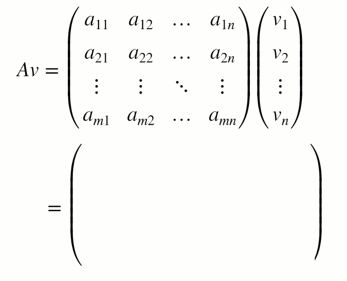

# Matrix Methods of Linear Algebra

or 

**Curriculum Module**  
_Created with R2020b. Compatible with R2020b and later releases._  

## Description ##
This curriculum module contains interactive [live scripts](https://www.mathworks.com/products/matlab/live-editor.html) that teach fundamental matrix methods commonly taught in introductory linear algebra courses. In the first part of each live script, students learn standard definitions, visualize concepts, and perform exercises on paper. Afterward, students practice complementary MATLAB&reg; methods. These methods reinforce the discussed concepts and help students to develop an early familiarity with computational software. Each lesson concludes with an illustrative application. These live scripts can be used as part of a lecture, as activities in an instructional setting, or as an interactive assignment to be completed outside of class.

The instructions inside the live scripts will guide you through the exercises and activities. Get started with each live script by running it one section at a time. To stop running the script or a section midway (for example, when an animation is in progress), use the Stop button in the RUN section of the Live Editor tab in the MATLAB Toolstrip.

## Get started with the interactive examples ##

**Option 1: Download to Desktop** Download and unzip the repository. Then, double-click the MatrixMethods.prj file inside MATLAB&reg;. 

**Option 2: [Open in MATLAB Online](https://matlab.mathworks.com/open/github/v1?repo=MathWorks-Teaching-Resources/Matrix-Methods-of-Linear-Algebra&project=MatrixMethods.prj)** Log in to your MathWorks account to access your license. If you are associated with a university, use your university email to access a license.

- From there, you can follow the landing page instructions to get started with the examples. 
- The instructions inside the live scripts will guide you through the exercises and activities. 
- Get started with each live script by running it one section at a time. 
- To stop running the script or a section midway (for example, if a loop is running longer than intended), click the  **Stop** button in the **RUN** section of the **Live Editor** tab in the MATLAB Toolstrip.

## Details ##
**`matrixOperations.mlx, matrixOperationsSoln.mlx`**  
An interactive lesson that explores basic matrix operations.

**Learning Goals:**
- Define matrices and their basic arithmetic operations
- Calculate the result of matrix operations on paper and in MATLAB
- Explain the size requirements of matrix operations
- Compare symbolic and numeric matrix operations in MATLAB
- Apply matrix methods to modify grayscale images

## ##
**`linearSystems.mlx, linearSystemsApplications.mlx, linearSystemsSoln.mlx, linearSystemsApplicationsSoln.mlx`**  
An interactive lesson that explores matrix representations of linear systems and their solutions.

**Learning Goals:**
- Write a linear system in matrix form
- Relate solutions of linear systems in 3-dimensions to their visualizations
- Solve systems of linear equations using row-reduction
- Solve systems of linear equations using matrix inverses
- Explain the solvability of a linear system in terms of the matrix determinant
- Use MATLAB to solve linear systems
- Apply matrix methods to linear regression and linear circuit analysis

## ##
**`eigenanalysis.mlx, eigenanalysisApplications.mlx, eigenanalysisSoln.mlx, eigenanalysisApplicationsSoln.mlx`**  
An interactive lesson that explores eigenvectors, eigenvalues, and their applications.

**Learning Goals:**
- Visualize eigenvectors in 2-dimensions
- Solve for the eigenvalues and eigenvectors of a 2x2 matrix on paper and larger matrices using MATLAB
- Diagonalize 2x2 matrices on paper and larger matrices in MATLAB
- Explain linear system solvability in terms of eigenvalues
- Discuss defective matrices
- Use eigenanalysis to understand vibrations and the long term behavior of a Markov chain

## Products ##
MATLAB, Symbolic Math Toolbox&trade;, Image Processing Toolbox&trade;, Statistics and Machine Learning Toolbox&trade;

## License ##
The license for this module is available in the [LICENSE.TXT](license.txt) file in this GitHub repository.

## Educator Resources ##
* [Featured Courseware](https://www.mathworks.com/academia/courseware/course-materials.html)
* [Teach with MATLAB and Simulink](https://www.mathworks.com/academia/educators.html)
* [MATLAB Grader](https://www.mathworks.com/products/matlab-grader.html)

Have any questions or feedback? Contact the <a href="mailto:onlineteaching@mathworks.com">MathWorks online teaching team.</a>

# #

_Copyright 2021-2022 The MathWorks, Inc._
